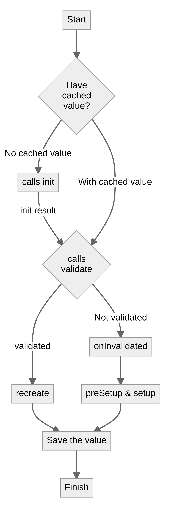

# cypress-data-session Authentication Example

The repo tests the paths though the cypress-data-session logic for the use case of User Authentication.

`npm i`, cd in, `npm run cy:open`.

All functions are dumb versions of a realistic authentication system.

---

`commands.spec.js` tests the lego building blocks that will compose into our main function `cy.maybeGetTokenAndUser`.

The function utilizes `cypress-data-session` in order to:

- re-use a token from the session if it has ever been used before. Ask for a new one if not.
- check if there is a user in the hypothetical DB

  - re-use if there is
  - generate a new user if not

  Save the user to the session in either case, so that next time it is used immediately.

## The logic as documented in the [Gleb's docs](https://github.com/bahmutov/cypress-data-session/blob/main/README.md)

- First, the code pulls cached data for the session name.

- if there is no cached value:

  - it calls the `init` method, which might return a value _(ex: a token)_
    - if there is a value && passes `validate` callback _(ex: cy.me() returns truthy)_
      - it calls `recreate`, saves the value in the data session and finishes
    - else it needs to generate the real value and save it _(ex: cy.me() returns falsey, fails validate())_
      - it calls `onInvalidated`, `preSetup` and `setup` methods and saves the value

- else (there is a cached value):
  - it calls `validate` with the cached value
    - if the `validate` returns `true`, the code calls `recreate` method
    - else it has to recompute the value, so it calls `onInvalidated`, `preSetup`, and `setup` methods

## Flowchart

<!--
Mermaid charts can be previewed using VSCode extension
Name: Markdown Preview Mermaid Support
Id: bierner.markdown-mermaid
VS Marketplace Link: https://marketplace.visualstudio.com/items?itemName=bierner.markdown-mermaid
-->

  
Flowchart source

```mermaid
flowchart TD
  A[Start] --> B{Have\ncached\nvalue?}
  B --> |No cached value| C[calls init]
  C --> |init result| D{calls\nvalidate}
  D --> |validated| J[recreate]
  J --> E[Save the value]
  E --> F[Finish]
  D --> |Not validated| H[onInvalidated]
  H --> G[preSetup & setup]
  G --> E
  B --> |With cached value| D
```

